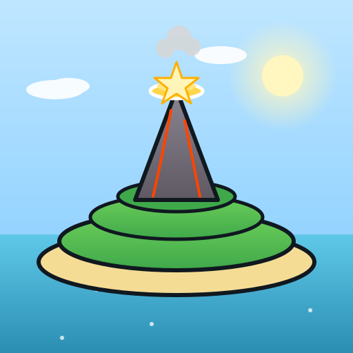

# 🌋 Volkaan Eiland

Wii Party geïnspireerde 3D Volcano Island bordspel-map, gerenderd in de browser met **Three.js**. Werkt als full-screen web-app op iPhone (getest op iPhone 17 Pro).



## 📦 Inhoud

| Bestand | Doel |
|---|---|
| `index.html` | De volledige scene (Three.js via CDN) — één standalone bestand |
| `manifest.json` | PWA-manifest, maakt installatie op home-screen mogelijk |
| `icon.svg` | Vector app-icoon |
| `icon-192.png` / `icon-512.png` | Standaard PWA icons |
| `apple-touch-icon.png` | 180×180 iOS home-screen icoon |
| `icon-maskable-512.png` | Maskable variant met safe-zone padding |

## 🚀 Deploy op GitHub Pages

```bash
# nieuw repo
git init
git add .
git commit -m "Initial Volkaan Eiland"
git branch -M main
git remote add origin https://github.com/<jouw-gebruikersnaam>/<repo-naam>.git
git push -u origin main
```

Daarna op GitHub:

1. Ga naar **Settings → Pages**
2. **Source**: `Deploy from a branch`
3. **Branch**: `main` / `(root)` → **Save**
4. Wacht ~1 minuut, je krijgt een URL zoals `https://<gebruiker>.github.io/<repo>/`

> ⚠️ Het pad in `manifest.json` (`start_url: "./"`) en alle asset-paden in `index.html` zijn relatief, dus het werkt zowel op de root (`username.github.io`) als in een subfolder (`username.github.io/repo/`).

## 📱 Installeren op iPhone 17 Pro

1. Open de GitHub Pages URL in **Safari** (niet Chrome — Chrome op iOS ondersteunt geen home-screen install)
2. Tik op de deel-knop (vierkant met pijl omhoog)
3. Scroll naar **"Zet op beginscherm"**
4. Bevestig met **"Voeg toe"**
5. Het Volkaan-icoon staat nu op je home-screen. Tikken opent de app **full-screen zonder Safari-balken**.

De volgende meta-tags maken dat mogelijk:

```html
<meta name="apple-mobile-web-app-capable" content="yes">
<meta name="apple-mobile-web-app-status-bar-style" content="black-translucent">
<meta name="viewport" content="..., viewport-fit=cover">
```

## 🎮 De map uitgelegd

**Hoofdpad** — 56 tegels in 6 kleuren, terrein-bewust geplaatst:

| Fase | Tegels | Locatie |
|---|---|---|
| 1 | 1-7 | Strand-loop (oost → zuid → west) |
| 2 | 8-19 | Grasterras 1 (lager), volledige rondgang |
| 3 | 20-28 | Grasterras 2 (midden), curve om vulkaan |
| 4 | 29-35 | Grasterras 3 (boven), spiraal om vulkaanbasis |
| 5 | 36-41 | Klim langs de vulkaankegel |
| 6 | 42 (laatste) | 🏆 **Gouden winnaarsplatform** op de top |

**Tegelkleuren**: blauw (neutraal), rood (neutraal), groen (start + neutraal), geel (event), paars (gevaar), oranje/lava (laatste klim).

**Straftegels** — Op elk van de 4 satelliet-eilandjes staat één paarse tegel met een spinnend wit waarschuwingsteken. Geen verbinding met het hoofdpad — gebruik ze in je spel-logica als teleport-bestemming, penalty-vakje, mini-game-arena, etc.

**Camera** — Auto-rotation start na 4 sec inactiviteit. Sleep / pinch werkt op touch en muis.

## 🛠️ Lokaal testen

`index.html` werkt direct in een browser, maar omdat het ES modules gebruikt moet je het via een lokale server openen (niet `file://`):

```bash
# Python 3
python3 -m http.server 8000

# of npx
npx serve .
```

Open daarna `http://localhost:8000/`.

## ⚡ Performance

- Pixel ratio gecapped op 2 voor Retina
- Shadow map 1024×1024 (mobile-vriendelijk)
- InstancedMesh voor gras (280), struiken (70), bloemen (132), kleine rotsen (50)
- Three.js gefetched van `unpkg.com` (~580 KB gzipped, gecached na eerste load)

## 📜 Licentie

Code: MIT — doe wat je wilt. Visuele stijl is een eerbetoon aan Nintendo's Wii Party "Volcano Island" maar gebruikt geen Nintendo-assets.
